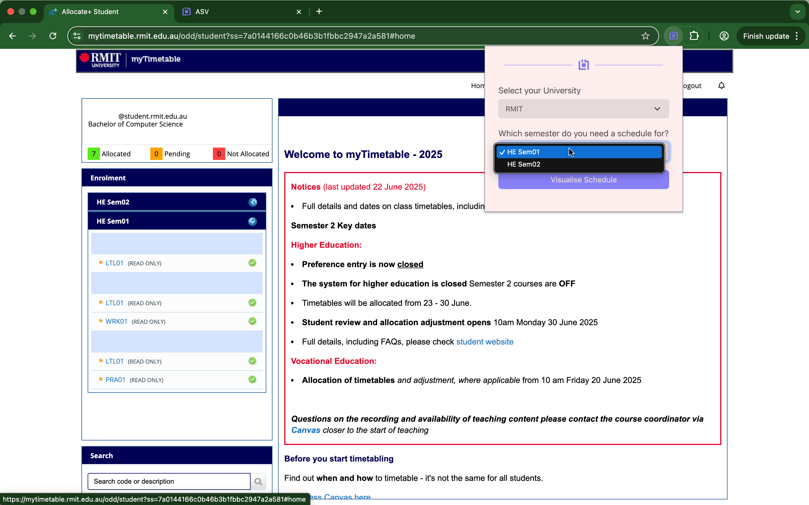
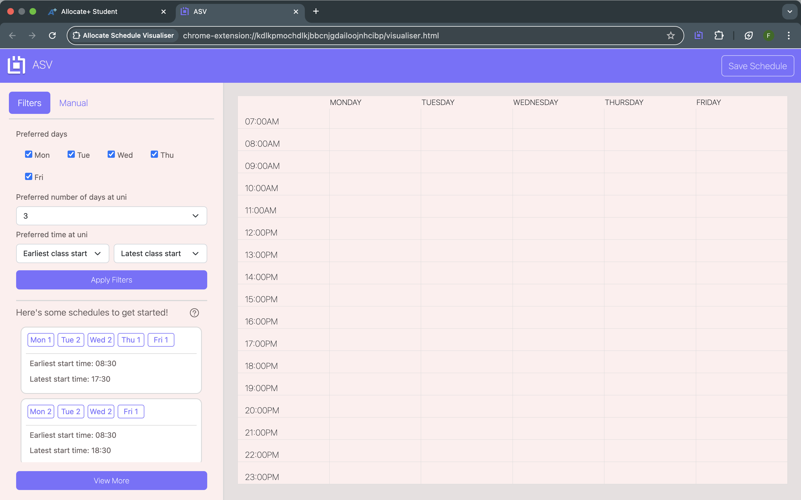
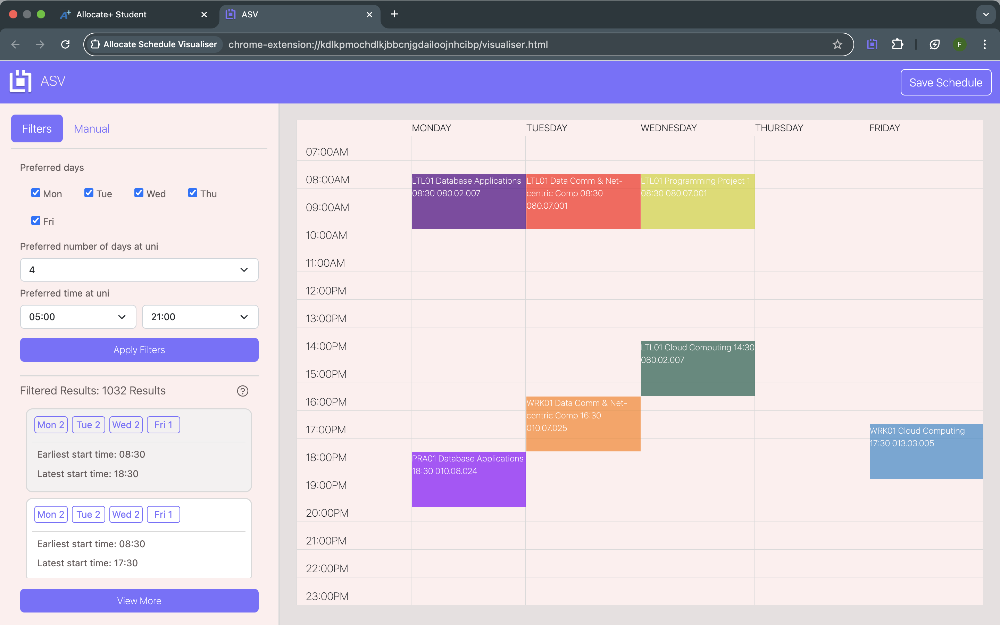

# Allocate-Schedule-Visualiser

Allocate Schedule Visualizer is a Chrome extension that helps you easily visualize schedules based on your available class time slots. This tool is designed to streamline the process of organizing your schedule, ensuring that you can quickly see which options fit within your availability.

## Features

- Simple and intuitive UI to input your available class time slots.

- Automatically generates schedules based on the timeslots of your units.

- Easily toggle between different scheduling options.

- Download your schedule that you generated as a PNG.

## Installation

1. Download or clone this repository.

2. Open Google Chrome and navigate to chrome://extensions/.

3. Enable "Developer mode" (toggle in the top right corner).

4. Click "Load unpacked" and select the /dist folder

5. The extension will be added to your browser and ready to use.

## Usage

1. Ensure you are logged into your allocate

2. Click on the extension icon in the Chrome toolbar.

3. Input your university and the semester you desire for your schedule.
   

4. The extension will retrieve all timeslot data from your units and open up a new tab.
   
   
5. Use the filters on the sidebar according to your preferences and select the one that best fits your needs.
   
6. If you want to put in your timeslots manually, navigate to the manual tab where there are dropdown to see how each unit fits in your schedule.
   

## Important Notes

- This chrome extension is exclusively for universities that use allocate and follow specific formatting on their timetable websites.

- The current version is currently only available for RMIT

## Contact

For any questions or feedback, feel free to open an issue or reach out via email - franciszald15@gmail.com

## Release Notes

### v1.1.0 (08/02/25)

- Initial Release

- Supports:

  - Automated collection of class timeslot data of user
  - Generation of non-conflict timetable schedules
  - Save/Download timetable data
  - Functionality to manually choose your classes

- Known Issues or Bugs
  - ~~Classes and timeslots are hidden in Allocate before semester start, and thus cannot collect any data~~ (fixed in v1.2.0)

### v1.2.0 (19/02/25)

- Fix to data collection

- Supports:

  - Navigation to preferences to collect data
  - Explicitly states both max and min days a student can attend university

- Known Issues or Bugs
  - ~~Issues found with data collection for those who are enrolled in different semeseter e.g. HE Flex, VE Flex~~ (fixed in v1.3.0)

### v1.3.0 (5/07/25)

- Rebuilt the data scraping logic to improve reliability and structure.

- Supports:

  - Automatically detects which semesters the student is enrolled in and displays them in the selector.
  - Users can now optionally include Flex semester classes when generating schedules.
  - Combines selected standard and Flex semester units seamlessly into one schedule preview.
  - Uses page source to collect the data
  - Checks if the current tab is on allocate, prompts user to navigate to allocate if they are elsewhere

## Change Log

### v1.2.0 (19/02/25)

- Changed data collection method, i.e. rather than navigating to each activity info page to collect data navigates to preferences page

### v1.3.0 (5/07/25)

- Rehauled data scraping logic such that it no longer uses Puppeteer to collect data
- Previous approach lacked consistency as the Allocate page would dynamically change according to enrollment period and a students chosen degree
- Removed "Collecting Data" content script as current approach collects it immediately
- Removed all dependencies in background.js as current approach doesn't require such dependencies
- Reorganised code, wherein the files for the visualiser and files for the core logic of the extension (background.js, content.js, etc.) are separate
