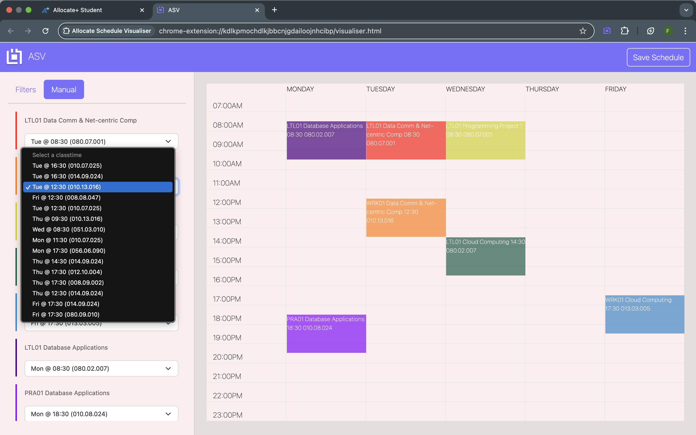

# Allocate-Schedule-Visualiser

Allocate Schedule Visualizer is a Chrome extension that helps you easily visualize schedules based on your available class time slots. This tool is designed to streamline the process of organizing your schedule, ensuring that you can quickly see which options fit within your availability.

## Features

- Simple and intuitive UI to input your available class time slots.

- Utilises the Puppeteer JS Library to scrape all your classes for each unit.

- Automatically generates schedules based on the timeslots of your units.

- Easily toggle between different scheduling options.

- Download your schedule that you generated as a PNG.

## Installation

1. Download or clone this repository.

2. Open Google Chrome and navigate to chrome://extensions/.

3. Enable "Developer mode" (toggle in the top right corner).

4. Click "Load unpacked" and select the /dist folder

5. The extension will be added to your browser and ready to use.

## Usage

1. Ensure you are logged into your allocate

2. Click on the extension icon in the Chrome toolbar.

3. Input your university and the semester you desire for your schedule.
   

4. The extension will retrieve all timeslot data from your units and open up a new tab.
   
   
5. Use the filters on the sidebar according to your preferences and select the one that best fits your needs.
   
6. If you want to put in your timeslots manually, there are dropdowns below to see how each unit fits in your schedule.
   

## Important Notes

- This chrome extension is exclusively for universities that use allocate and follow specific formatting on their timetable websites.

- The current version is currently only available for RMIT

- This extension uses Puppeteer, and its ability to scrape content and therefore collect and generate data will be highly dependent on the formatting of your allocate units. For instance, the extension will look for specific html elements that contain your information on your units, and if it's unable to find it due to any formatting irregularities, the extension will be unsuccesful in generating your schedules.

- Therefore, please be aware that the following cases are not supported in the current version.
  - If you're enrolled in Summer semesters / Winter semesters
  - Table headers do not include some of the following "Activity", "Day", "Time", "Campus", "Location", "Duration"," Description"

## Contact

For any questions or feedback, feel free to open an issue or reach out via email - franciszald15@gmail.com
